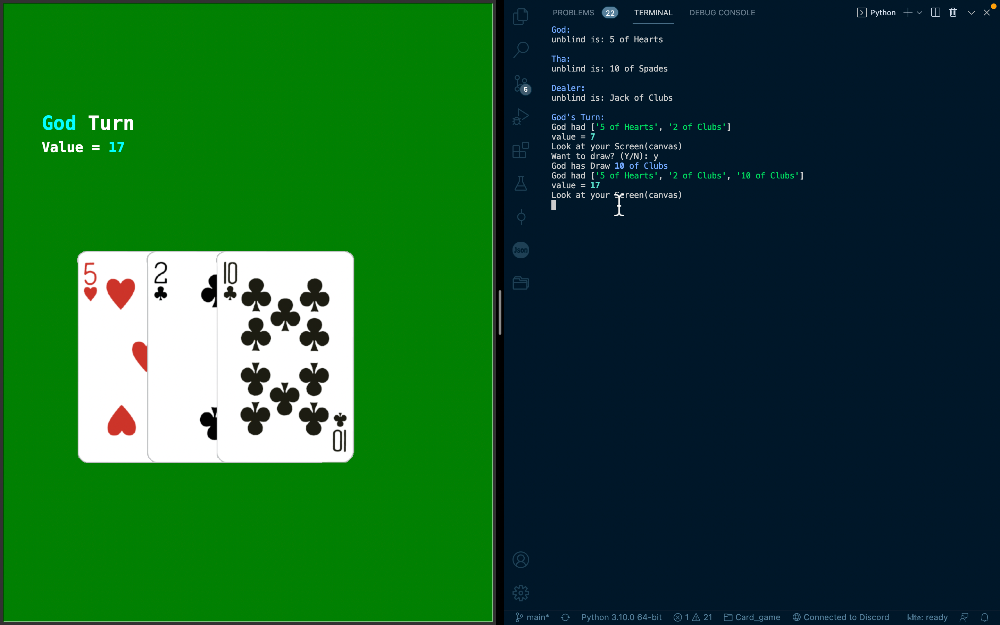

# Card Game
This project was made for computer Programming I Acedemic year 2021 by Preawpan Thamapipol

## About this project

This Card Game include 2 main game including `Pok Deng` and `Black Jack` game. In every game user will input all
player's name then a list of player object will be created by name in that list. then lets play, the game will loop
untill has only one player who has money more than 0. in the other hand,all people except that guy have no money
anymore (less than 0). When a game start the graphical output will show each player hand. At the end, The game will show
the winner and update score into CSV file.

* here is the overview of this project  
<https://youtu.be/nXyqYJq4f0w>

---

## Project overview and features

### Main features

- play BlackJack
- play Pokdeng

At first Program will ask user what game to play whether BlackJack or PokDeng as picture below

for Example, I will choose blackJackGame

if I selected show rule

and This is overview of blackjackgame

graphic is used to show player hand as shown below

and if I choose to see wincount, it will be same as below

---
** NOTE **

screen here is the full screen but real canvas size is 600 x 420. So, the picture above is look so disproportionate

---

## Requirement

This is requirement for this project

### python version

* [Python 3.10](https://www.python.org/downloads/)

### module

* [Rich 10.15.0](https://pypi.org/project/rich/)

**NOTE** Reccomand to run via terminal because it will better color quality(in rich module)

---

## Program design

### [This Project UML class diagram here](Uml_Card_Game_Project.png)

All my class that I am going to implement are

1. `Card`: a deck of card

2. `Player`: Parent Class of Each game player

3. `BlackJackPlayer`: BlackJackPlayer (child class of Player)

4. `PokDengPlayer`: PokDengplayer (child class of Player)

5. `BaseGame`: Parent Class of each game/ every game should have its

6. `BlackJack.Computer_Player`: BlackJack's computer player (child class of BlackJackPlayer)

7. `Black_Jack.Game`: BlackJack main game (child class of BaseGame)

8. `Pok_deng.Computer_Player`: PokDeng's computer player (child class of PokDengPlayer)

9. `Pok_deng.Game`: PokDeng main game (child class of BaseGame)

10. `Save`: database of the game which write data(name and money and win count) into CSV file.

11. `Screen`: Display a player hand screen with turtle graphic

---

## Code structure

In my card Game Project have 9 main file which are

1. [Card.py](Deck/Card.py): module for [BaseGame](Game/BaseGame.py) that contain `Card` class

2. [Hand.py](Player/Hand.py): module file for [Player](Player/Player.py) that contain `Screen` class that illustrate
   each player hand

3. [Player.py](Player/Player.py): module file that contain all type of Player including `Player`, `BlackJackPlayer`,
   and `PokDengPlayer` class

4. [BaseGame.py](Game/BaseGame.py): module file for anygame that contain `BaseGame` class

5. [Black_Jack.py](Game/Black_Jack.py): sub file that are one `BlackJack` entile game which
   contain `Black_Jack.ComputerPlayer` and `Black_Jack.Game` class and main function for run a entire `BlackJack` game

6. [Pok_Deng.py](Game/Pok_deng.py): sub file that are one `PokDeng` entile game which contain `Pok_Deng.ComputerPlayer`
   and `Pok_Deng.Game` class and main function for run a entire `Pok Deng` game

7. [database.py](Game/database.py): module file that contain `Save` class

8. [history.csv](history.csv): CSV file for collecting data in `database`

9. [main.py](main.py): main file that run entire thing

---
