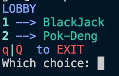
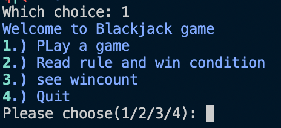
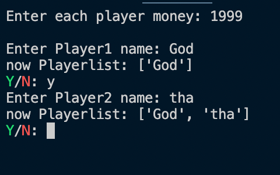
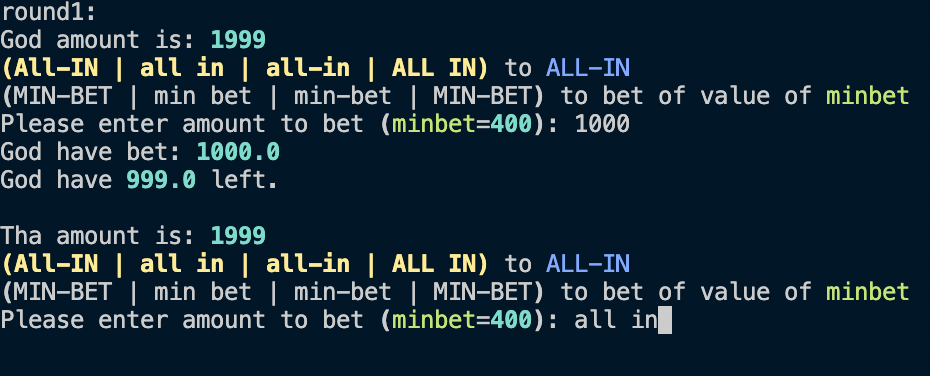

# Card Game

## Project overview and features

At first Program will ask user what game to play whether BlackJack or PokDeng as picture below

for this case I will chosse blackJackGame

if I selected show rule

and This is a overview of blackjackgame

graphic is used to show player hand as shown below

and if i choose to see wincount it will be same as below

---
**NOTE**

screen here is the full screen but real canvas size is 600 x 420. So, the picture above is look so disproportionateใ

---

## Requirement

This is requirement for this project

### python version

* [Python 3.10](https://www.python.org/downloads/)

### module

* [Rich 10.15.0](https://pypi.org/project/rich/)

**NOTE**
Reccomand to run via terminal because it will better color quality(in rich module)

## Program design

what are your classes are and what are their objectives

## Code structure

how many source files and what each of them contains

<!-- 
There is no definite rule on how you should implement your objects.  However, at
least the following are required:

* `account.py` module is not allowed to use for writing a JSON file. 
* `database.py` module is the only one that you can use for writing a JSON file.
* Please use `accounts.json` as a file name for storing the data.</u>

The module `account.py` defines the `BankAccount` class.  Each `ฺBankAccount` object consists of
the `number`, `name`, `balance` and `db` properties.  The `balance` property must be a positive numbers, where the `name` 
and `number` are `String`. The `db` property must be a `BankDB` object.

    >>> from account import BankAccount

    >>> type(BankAccount.number)
    <class 'property'>
    >>> type(BankAccount.name)
    <class 'property'>
    >>> type(BankAccount.balance)
    <class 'property'>
    >>> type(BankAccount.db)
    <class 'property'>

Initialization
==============

 A`BankDB` object must be initialized with a name of database.

    >>> from database import BankDB

    >>> db = BankDB("accounts")
    >>> db
    BankDB(name="accounts")

A `BankAccount` object must be initialized with an account number, a name, a balance and `BankDB` object.

Once the `BankAccount` object has been created, it executes the `insert` method from `BankDB` object automatically to create `accounts.json` file, 
and put the data below into the file.

    new_data = {
            bank_account.number: {
                "name": bank_account.name,
                "balance": bank_account.balance,
            }
        }

The examples of initialization are shown below.

    >>> import json

    >>> p1 = BankAccount("333-333", "Torres", 5000, db)
    >>> p1
    Account(number="333-333", name="Torres", balance=5000, db="accounts")

    >>> p2 = BankAccount("555-555", "Alex", 8000, db)
    >>> p2
    Account(number="555-555", name="Alex", balance=8000, db="accounts")

    >>> with open("accounts.json", "r") as data_file:
    ...     data = json.load(data_file)
    ... 
    >>> data["333-333"]
    {'name': 'Torres', 'balance': 5000}
    >>> data["555-555"]
    {'name': 'Alex', 'balance': 8000}

    >>> p3 = BankAccount("666-666", "Bob", "4000", db)
    Traceback (most recent call last):
    ...
    TypeError: balance must be a number

    >>> p4 = BankAccount(888888, "Jota", 4000, db)
    Traceback (most recent call last):
    ...
    TypeError: account number must be a string

    >>> p5 = BankAccount("999-999", "Mane", -500, db)
    Traceback (most recent call last):
    ...
    ValueError: balance must be greater than zero

Using methods
===================

###`BankAccount` class consists of the `deposit`, `withdraw` and `transfer` methods.

####`deposit` method: 

    >>> p1.deposit(200)
    UPDATE account 333-333 balance = 5200

    >>> with open("accounts.json", "r") as data_file:
    ...     data = json.load(data_file)
    ...
    >>> data['333-333']['balance']
    5200

    >>> p1
    Account(number="333-333", name="Torres", balance=5200, db="accounts")

####`withdraw` method:

    >>> p2.withdraw(5000)
    UPDATE account 555-555 balance = 3000

    >>> with open("accounts.json", "r") as data_file:
    ...     data = json.load(data_file)
    ...
    >>> data['555-555']['balance']
    3000

    >>> p2
    Account(number="555-555", name="Alex", balance=3000, db="accounts")

    >>> p2.withdraw(4000)
    Not enough money

####`transfer` method:

    >>> p2.transfer(2000,p1)
    UPDATE account 555-555 balance = 1000
    UPDATE account 333-333 balance = 7200

    >>> with open("accounts.json", "r") as data_file:
    ...     data = json.load(data_file)
    ...
    >>> data['333-333']
    {'name': 'Torres', 'balance': 7200}
    >>> data['555-555']
    {'name': 'Alex', 'balance': 1000}

    >>> p2.transfer(3000,p1)
    Not enough money
    >>> p2
    Account(number="555-555", name="Alex", balance=1000, db="accounts")

###`BankDB` class consists of the `insert`, `search` and `delete` methods.
We have mentioned about `insert` method earlier. Let's see more details of `search` and `delete` methods.

    >>> db.search("333-333")
    Name=Torres, Balance=7200
    >>> db.search("777-777")
    No data for account number: 777-777

    >>> db.delete("777-777")
    No data for account number: 777-777
    >>> db.delete("333-333")
    DELETE account 333-333
    >>> with open("accounts.json", "r") as data_file:
    ...     data = json.load(data_file)
    ...
    >>> data['333-333']
    Traceback (most recent call last):
    ...
    KeyError: '333-333'
 -->

<!-- 
In this assignment, you are to implement a bank account, as shown.

## Modules

Your application consists of two modules, that must be completed by
you. Please look at `bankaccount.md` [documentation](docs/bankaccount.md) 
for more details, including test cases that will be used to grade this module.

### 1. Module `account.py` 

This module contains the `BankAccount` class for creating each user account.

    class BankAccount:
        def __init__(self, number, name, balance, db):
            self.number = number
            self.name = name
            self.balance = balance
            self.db = db
            db.insert(self)

        # add your implementation

        def deposit(self, amount):
            # add your implementation

        def withdraw(self, amount):
            # add your implementation

        def transfer(self, amount, to_account):
            # add your implementation

        def __repr__(self):
            # add your implementation

The provided `account.py` contains only some template code that you must
complete yourself. 

### 2. Module `database.py`

This module contains the `BankDB` class for creating a database file.

    class BankDB:
        def __init__(self, name):
            self.name = name

        def insert(self, bank_account):
            # add your implementation

        def search(self, account_number):
            # add your implementation

        def delete(self, account_number):
            # add your implementation

        def record_transaction(self, account, amount):
            # add your implementation

        def __repr__(self):
            # add your implementation

The provided `database.py` contains only some template code that you must
complete yourself.

## Running Tests

Tests can be performed by running the `main.py`.  They use the `doctest` to run all
examples found inside all the documentation files in the `docs` directory.

    python main.py

## Your Task

1. Complete the implementations of the `account.py` and `database.py`
   modules.  Make sure they all pass the tests.
2. Run `main.py` to see the result and inspect the correctness.
3. Modify the `summary.txt` file.  In this summary, tell us what you have
   completed and what you have not.

**Notes:** Please do not change any file inside the `docs` directory.  These
files will be used to run tests against your submitted code.

## Submission

1. Check that everything is working as expected, i.e., all the tests are
   passed.
2. Commit your code with all related files
    * `account.py`
    * `database.py`
    * `summary.txt`
3. Push the commit to GitHub
4. Wait for GitHub Classroom to mail back your grading result.

## Grading Criteria

1. **Correctness (70%):** Your program must pass all the doctests.
3. **Cleanliness (30%):** Your program must follow the PEP8 convention.  Variable
   names are meaningful.  Docstrings are written for all methods and
   functions.  Comments are added at certain points for others to understand
   your code easily.
    -->
